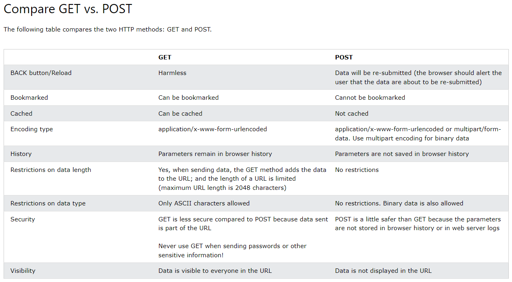

# api-intro

### Compare GET vs. POST
[Resource w3schools](https://www.w3schools.com/tags/ref_httpmethods.asp)

### HTTP Status Code 
[Resource infidigit](https://www.infidigit.com/blog/http-status-codes/)
